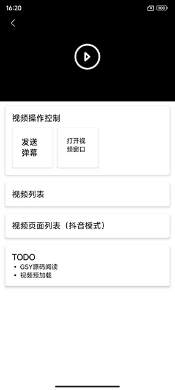

## DuDemo

使用Kotlin和MVVM模式，搭建手脚架、工具方法

### 下载预览

 

### Common Api

- AppStartup：使用ContentProvider优化启动初始化流程，减轻Application负担
- SplashScreen启动画面：优化启动白屏问题
- Title：Activity和Fragment注解@Title方式增加标题栏，CollapsingToolbarLayout的运用
          DEF - 默认固定
          COLL - 伸缩动态
- ViewBinding：Base层泛型初始化实现
- RootLayout：Activity和Fragment加入根布局，装载标题、加载UI、空布局UI
-  PermissionX：权限判断，在当前Activity加入空布局的Fragment完成判断流程

 

### 天气预报

根据《第一行代码》Demo进行优化调整
- 沉浸式标题栏适配，已适配sdk30，StatusBarUtil
- ViewModel：Base层泛型初始化实现，LiveData更改时通知视图
- DataStore：代替SharedPreferences，封装委托by方式实现调用
- Retrofit：网络请求，手机网络异常、服务器接口异常、接口业务异常，展示不同失败UI
        CallAdapter：增加Flow数据流方式返回
        Converter：增加kotlinx.serialization解析JSON，同时判断业务ErrorCode

 

### 文件下载

实现Apk下载安装流程，多文件下载断点续传
- ConstraintLayout：子view自动换行
- FileUtil：获取app沙盒路径，文件操作
- Retrofit：实现断点续传网络请求处理，下载资源文件判断
- Flow：collectLatest上游发射过快忽略旧数据，保证下游刷新UI,更新下载任务数据库状态，刷新通知
- Room：下载任务数据持久化保存
- Notification：刷新下载进度通知UI，使用Service展示前台通知，保证后台长期下载
- apk安装：app安装权限处理，FileProvider需提供其他应用Uri路径处理
- gradle：根据配置参数自动生成xml资源文件

 

### 相册

系统相册，系统相机拍照，裁剪图片，自定义图库

- ImageLoader：按需装填不同的图片请求库（当前主要使用Coil），该模式仅图库使用，不建议整个App使用（会重载方法，丧失链式API）
- registerForActivityResult：扩展封装界面回调方式，处理回调更简洁
- ContentResolver：媒体数据库查询，flow数据流方式返回

   

### 日志

- 调试日志：编码环节，debug模式下，仅控制台输出，封装Logger实现
- 数据及状态埋点日志：输出到控制台和文件归档，日志回捞（必要是推送push提交）需提交的日志文件，封装XLog实现
- 异常日志：Crash崩溃日志，输出到控制台和文件归档，下次打开app触发提交，封装XCrash实现
- 行为埋点日志：业务需求需记录的行为日志、曝光日志、点击日志，输出到控制台和数据库记录，根据时间段提交

 

### 视频

- GSYVideoPlayer：视频播放SDK，支持IJKPlayer、EXOPlayer2、MediaPlayer
- 模拟实现视频列表、仿抖音竖屏列表，弹幕，窗口视频播放，还需更深入理解源码实现、视频预加载等

 

### 音频

- 音乐播放器：Jetpack Media3构建，ExoPlayer解析媒体，MediaLibrarySession构建会话提供媒体信息，MediaLibraryService媒体服务处理后台播放，MediaBrowser媒体客户端媒体控制器，MediaStyleNotificationHelper.MediaStyle统一媒体通知播放控制器，适配蓝牙按钮控制，音频焦点切换暂停
- 提示音：SoundPool音频资源可预加载到内存中，短音频一次或循环播放，整合操作类SoundManager，通常作用按键音或推送通知信息提示音
- 音乐播放小部件：AppWidgetProvider，拉起媒体服务、弹出媒体播放通知、小部件获取通知刷新控件播放状态
- 其他：CustomBottomSheetDialog底部弹出控件、本地音频媒体获取

  
